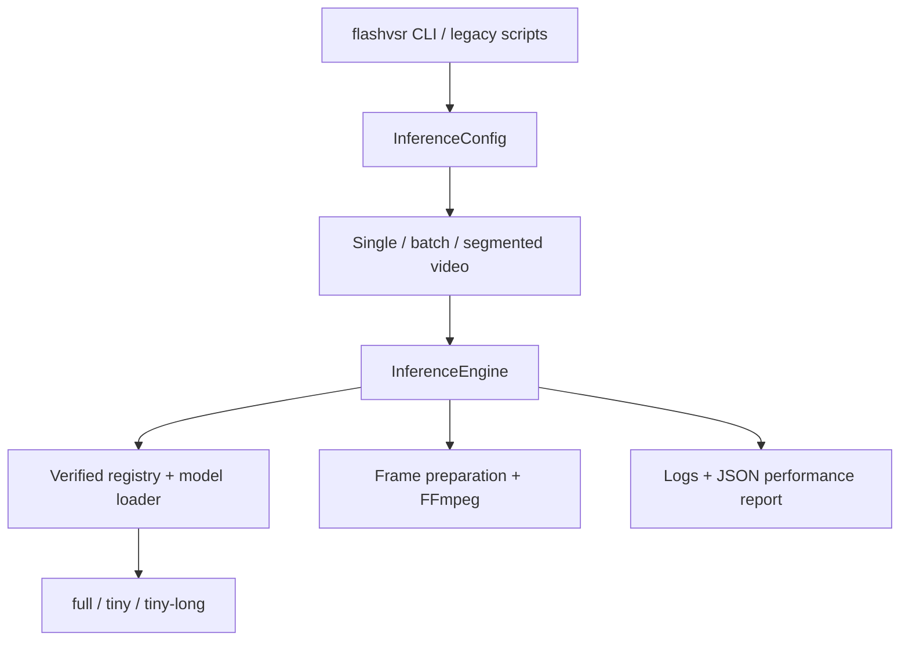

# FlashVSR application architecture

This fork contains a FlashVSR-only DiffSynth subset. Python 3.13–3.14, PyTorch
2.11.0+cu128 and CUDA Toolkit 12.8+ within 12.x are the supported baseline.

## Execution flow

| Module | Responsibility |
| --- | --- |
| `flashvsr/cli.py`, `__main__.py` | Parse commands, configure logs, map failures to exit codes |
| `flashvsr/config.py` | Immutable configuration, validation, output/report path rules |
| `flashvsr/engine.py` | Preflight, model lifecycle, inference, output and metrics |
| `flashvsr/workflows.py`, `long_video.py` | Recursive batches and resumable bounded long-video processing |
| `flashvsr/jobs.py`, `streaming.py` | Locked atomic job records, integrity checks and backpressured FFmpeg decoding |
| `flashvsr/frames.py` | Decode all frames, natural image order, bicubic resize, spatial/temporal padding |
| `flashvsr/media.py` | FFmpeg/FFprobe version detection, NVENC probe and retry, all audio tracks, atomic verified output |
| `flashvsr/models.py`, `assets/models.json` | Model versions, cache, pinned downloads and SHA-256 verification |
| `flashvsr/model_loading.py` | Strict DiT/projector/decoder loading and fixed prompt initialization |
| `flashvsr/observability.py` | Logging configuration, run identifiers and report schema |
| `utils/` | Projector, decoder, tiling, checkpoint and CUDA checks; small compatibility imports |

The three top-level scripts only forward to `flashvsr infer`, `flashvsr batch`
and `flashvsr long`. They contain no separate inference implementation. Library
callers construct `InferenceConfig` and call `InferenceEngine(config).run(...)`.
Argument parsing, model listing, checks and downloads work without importing
PyTorch. Actual inference still requires the compiled sparse attention backend.

Standalone inputs and batch items get a fresh pipeline. Long jobs use an explicit
`InferenceEngine.session()` to load one model lazily and retain weights and fixed
prompt KV across segments. Projector, decoder and local attention masks are reset
before and after every call. Per-call self-attention KV remains local to the
pipeline invocation. A failed call discards the model; session exit releases it,
including on interruption. Models are released before final video encoding.

## Retained DiffSynth dependencies

The dependency trace starts at the three FlashVSR pipelines and follows their
imports and dynamically selected decoder/VRAM helpers:

| Consumer | Retained dependencies |
| --- | --- |
| All three pipelines | `pipelines/base.py`, shared `pipelines/color.py`, `schedulers/flow_match.py` |
| DiT and fixed prompt | `models/wan_video_dit.py`, `models/utils.py`, `block_sparse_attn` |
| Full decoder | `models/wan_video_vae.py` and its normalization/convolution classes |
| Tiny decoders | `utils/TCDecoder.py`, `utils/vae_manager.py` |
| Offloading | `vram_management/layers.py`, meta-device initialization in `models/utils.py` |
| Tiling/projector | `utils/tile_utils.py`, `utils/utils.py` |

Generic ModelManager autodetection, other image/video generation pipelines,
SD/SDXL/Flux/Cog/Hunyuan/Step/other Wan models, training, prompt/tokenizer data,
controlnets, processors, extensions and unused schedulers are removed. Dormant
multi-GPU `xfuser` branches are removed. Public imports are explicit or lazy;
runtime packages do not use wildcard imports. CUDA/CUTLASS sources are retained.

FlashVSR's DiT architecture is pinned in the model manifest: 30 layers, width
1536, 12 heads, FFN 8960, input/output channels 16. These dimensions and the
tensor-key/shape fingerprint were checked against the safetensors header at
the pinned upstream revision. The strict loader no longer attempts to detect
unrelated Wan variants. CPU tests instantiate the same architecture on the
meta device and compare the fingerprint without allocating the model weights.

Removing unused consumers also removes their direct Python dependencies:
Transformers, tokenizers/SentencePiece, ModelScope, Hugging Face Hub, OpenCV,
torchvision/torchaudio, training and data-analysis packages. The runtime now
pins eight direct dependencies. Optional FlashAttention/SageAttention paths
inside the retained DiT are unchanged; install them only with separate GPU
validation. Environment reports record available optional package versions.

## Model versions and integrity

`flashvsr/assets/models.json` pins the upstream repository revision, exact byte
counts and SHA-256 digests. Remote values come from the upstream
[Hugging Face file metadata](https://huggingface.co/api/models/JunhaoZhuang/FlashVSR-v1.1/revision/27561b186ded3402d7c975f4fd722e2885b6135f?blobs=true);
the bundled prompt has its own digest. Revision
`27561b186ded3402d7c975f4fd722e2885b6135f` is used in every download URL.

Directory precedence is `--model-dir`, `FLASHVSR_MODEL_PATH`, the legacy
`FLASHVSR-Pro_MODEL_PATH`, then `${FLASHVSR_CACHE_DIR}/v1.1`. The default cache
root is `${XDG_CACHE_HOME:-~/.cache}/flashvsr`. All selected weights and the
copied fixed prompt live in the same version directory.

Downloads take a directory lock, stream to a unique `.part` file, verify size
and digest, then atomically replace the target. An interrupted or corrupt
download removes its partial file and leaves the existing target intact. A
retry starts the file again; partial byte-range resumption is not implemented.
Valid local files are reused without downloading. `models check`, standalone
inputs and batch items hash all selected weights. Long jobs verify once at session
entry before decoding; the verified in-memory weights are reused for that session.
Every new process verifies again. Checks are local and never trigger downloads.

Changing a model release requires adding a manifest version with independently
verified digests and compatible architecture, updating loaders when necessary,
and running the real GPU acceptance suite.

## Reports and output guarantees

Every inference run writes `OUTPUT.json` unless `--metrics-json` selects another
path. Reports have `schema_version: 1`, run ID, status/failure stage, effective
parameters, input/output paths, model version/revision/digests, package versions,
GPU/CUDA, timings, FPS and peak allocated/reserved CUDA memory. FPS distinguishes
inference time from end-to-end time. Timings separate preflight, model load,
decode, inference, postprocessing and encoding. CUDA stages synchronize before
and after timing. Peaks include model loading and preprocessing. These reports
aid reproduction; TF32/cuDNN and optional attention kernels do not promise
bitwise deterministic GPU results.

`--log-level` controls leveled stderr logs; `--log-file` appends JSONL records
with matching run IDs. Debug logging includes tracebacks. `models list/check`
intentionally print machine-readable JSON to stdout.

Batch reports contain per-input results and failure counts. Long-video reports
contain per-segment results and the merged output metadata; original audio is
attached once after video concatenation. Concatenation places each next segment
using its predecessor's frame count and FPS, avoiding gaps from container
timestamp offsets, and verifies the merged FPS. Output encoding uses `-fps_mode
cfr` on FFmpeg 5.1+ and the equivalent legacy `-vsync 1` on older releases.
Reports record the detected FFmpeg version. MP4/MOV/MKV use HEVC NVENC with
`p7`, HQ tuning, VBR/CQ 20 at default quality, full-resolution multipass,
three B-frames, middle B references, 32-frame lookahead, spatial/temporal AQ
and `yuv420p`. A 40-frame test encode with these exact settings runs before
hardware encoding; a failure or unexpected output codec triggers libx264.
AVI retains H.264 NVENC. Frame count, FPS, dimensions, codec, and audio checks
stay strict across versions. Long-job checkpoints use lossless RGB FFV1; the final
encode streams a concat list and can replay it for software fallback without
repeating inference. Checkpoints are retained on failure and deleted on success
unless `--keep-temp` is set. Final media replaces an existing
file only after verification. Failure reports may replace older reports to
describe the latest attempt; media and JSON publication are separate operations.

Frame preparation preallocates one tensor and fills it with batches of at most
32 decoded frames. Spatial padding is unchanged; 8n+1 temporal alignment now
includes 16 lookahead frames (minimum 25 total), so a short final segment can
execute the streaming model. Output is cropped to the exact
scaled resolution and trimmed to the original frame count. If a pipeline
returns too few frames, the existing last-frame repeat policy remains and now
emits a warning plus `generated_frames` in the report. Whole-clip preparation
still uses memory proportional to clip length; use `flashvsr long` for large
inputs. Segment boundaries may introduce visual discontinuities.

Long jobs consume raw RGB frames sequentially from FFmpeg with pipe backpressure.
The frame ceiling is independent of keyframes; VFR is normalized while preserving
decoded frame order/count. Frame-based resume scans the prefix inside FFmpeg rather
than approximate timestamp seeking. Only one segment buffer/tensor is processed
at a time. Metadata and lossless disk checkpoints grow with segment count/duration.

`job.json` uses atomic replacement and fsync under a nonblocking advisory file
lock. It pins input content, model identity, runtime, processing revision, config
and the frame plan. Completed cache entries require both SHA-256 and media checks.
Only committed entries are reused after a crash; an interrupted segment restarts.
The final file also has a content hash for idempotent completed resumes. Parameters
or input changes require a new job directory. Keep `PROCESSING_REVISION` current
when changing inference semantics. Long reports include frame offsets,
`model_reused`, current-invocation model loads/processed/reused counts and peak VRAM
across stored segment reports (including previous invocations).

See [TESTING.md](TESTING.md) for CPU coverage and the separate real GPU gate.
